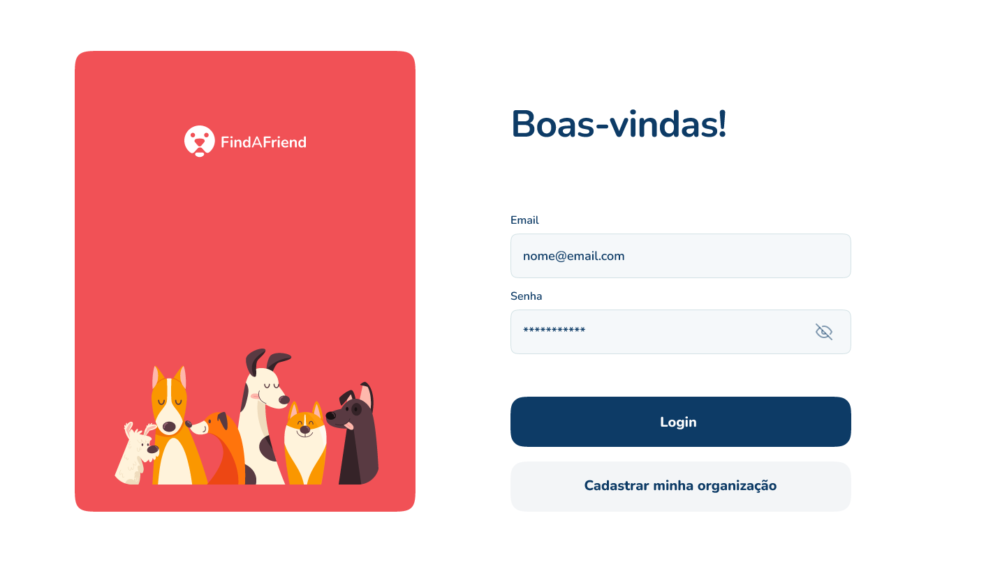
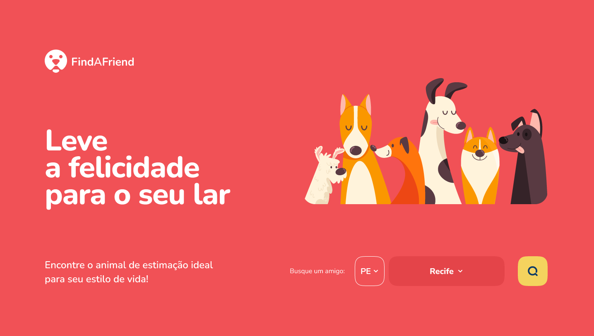
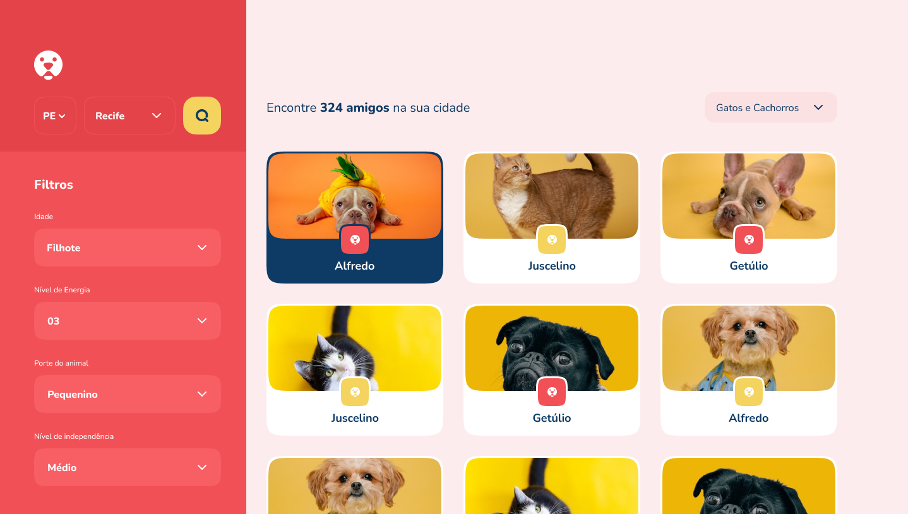

<h1 align="center">🐱 FIND A FRIEND 🐶</h1>

<p align="center">
  
  
  
</p>

## Tecnologias

- [Node](https://nodejs.org/en/docs)
- [Typescript](https://www.typescriptlang.org/docs/)
- [Fastify](https://fastify.dev/docs/latest/)
- [JWT](https://jwt.io/introduction)
- [Docker](https://docs.docker.com/)
- [Vitest](https://vitest.dev/)

## Regras da aplicação 

### RFs (Requisitos funcionais)

- [x] Deve ser possível cadastrar um pet
- [x] Deve ser possível listar todos os pets disponíveis para adoção em uma cidade
- [x] Deve ser possível filtrar pets por suas características
- [x] Deve ser possível visualizar detalhes de um pet para adoção
- [x] Deve ser possível se cadastrar como uma ORG
- [x] Deve ser possível realizar login como uma ORG

### RNs (Regras de negócio)

- [x] Para listar os pets, obrigatoriamente precisamos informar a cidade
- [x] Uma ORG precisa ter um endereço e um número de WhatsApp
- [x] Um pet deve estar ligado a uma ORG
- [x] O usuário que quer adotar, entrará em contato com a ORG via WhatsApp
- [x] Todos os filtros, além da cidade, são opcionais
- [x] Para uma ORG acessar a aplicação como admin, ela precisa estar logada

## Rotas
- Faz login e autenticação dentro de uma ORG
```bash
POST /sessions
```

- Faz a criação de uma nova ORG
```bash
POST /orgs
```

- Faz a publicação de uma novo PET na plataforma (apenas ADMIN)
```bash
POST /pets
```

- Realiza a busca de PETS por estado e cidades
```bash
GET /pets/:state/:city
```

-  Busca detalhes do PET
```bash
GET /pets/:petId
```

## Testes automatizados (E2E)

  - [x] Should be able to register
  - [x] Should not be able to register with same email
  - [x] Should be able to fetch pets by state and city
  - [x] Should be able to get details of a pet
  - [x] Should be able to authenticate
  - [x] Should be able to create a new pet

## Autor

[](https://www.linkedin.com/in/matheusgmello/)
